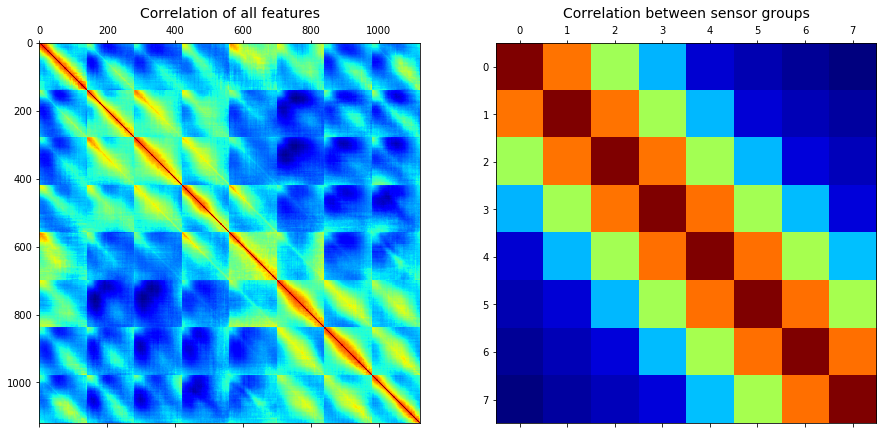
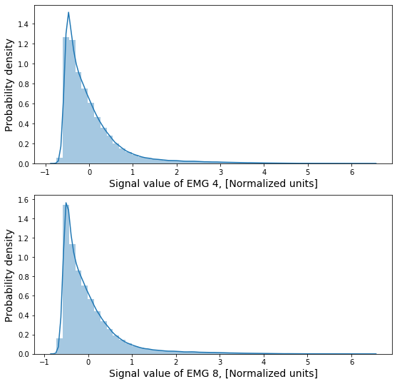

## Data analysis

For first example small dataset with 3 different gestures was recorded (about 60 elements for each class)

#### Classes:
- Fist
- Palm
- Relax

Correlation matrix was calculated in 2 variations:
- all features with all (720*720)
- all sensors curves with all(8*8)

No strong correlation between features so we shouldn't reduce dimension

Correlation effect increase near corners because those sensors are close to each other (it is cycle)

Next, see at distribution of values in each sensor for all classes

For example graphs of distribution of 4 and 8 sensors (other have similar ones)

## Create and fitting model

Recurent neural network model was choised as more effective in time series and human action recognition.
Architecture includes few LSTM layers with dropout to avoid overfitting:

- Input layer 8*90
- LSTM layer with 50 units and 0,2 dropout
- LSTM layer with 50 units and 0,2 dropout
- LSTM layer with 50 units and 0,2 dropout
- LSTM layer with 50 units and 0,2 dropout
- Ordinary layer with 64 units
- Ordinary layer with 128 units
- Output layer with 3 options

[Wiki about LSTM](https://en.wikipedia.org/wiki/Long_short-term_memory)

#### Graphs of loss and accuracy on 25 epochs with 0.25 validation data from our dataset:

#### Validation loss: 0.1998 
#### Validation accuracy: 0.9070

It is a very good result for such small sample. It show us that we can recognize more gestures with more dataset and increase accuracy.
