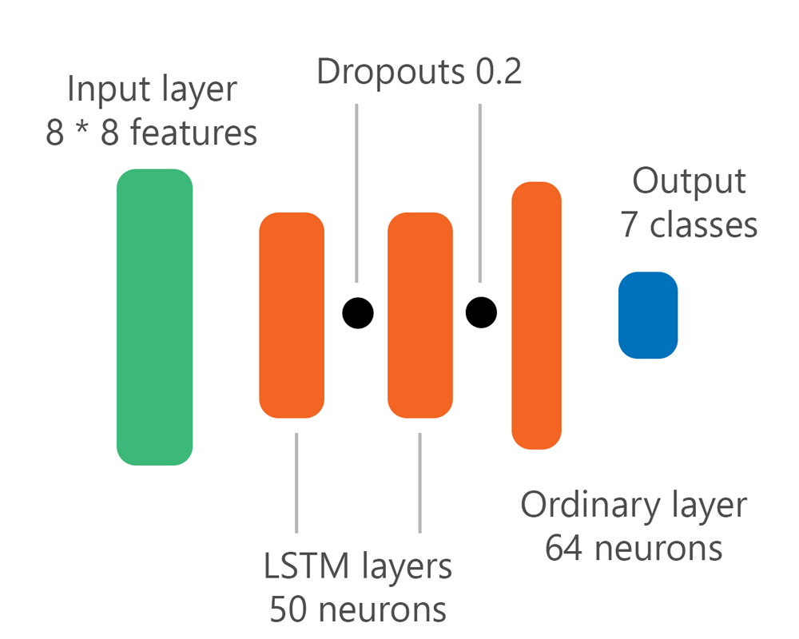
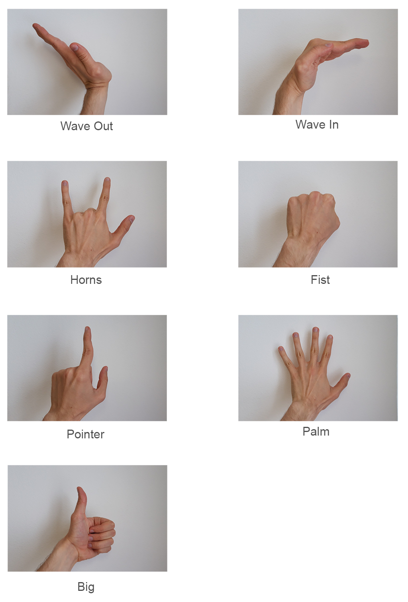
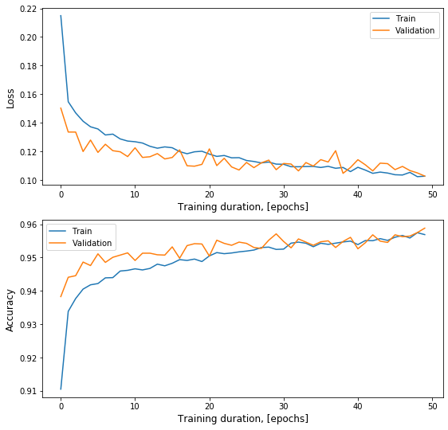

# MyoArmControl
Research of mechanical control via myoelectrical signals using Myo Armband. 

Student work in Technical University of Liberec (TUL) under supervision of [Dr. Jan Koprnicky, PhD](https://www.fm.tul.cz/personal/jan.koprnicky).
The work was described in the master's thesis and defended at TUL ([full text here](Papers/thesis.pdf)).

New results were presented in the article for Student Conferense of Faculty of Mechatronics in TUL ([see here](Papers/skfm.pdf)).

## Targets

- find optimal EMG signal filtering method (in accuracy and computational cost)
- create effective ML model for gesture recognition
- move this model on remote device (such Arduino board) or  coumuter native program
- exercise control

## Preview

<!-- .element height="50%" width="50%" -->

## Requirements 
Python: 3.6
- tensorflow==1.4.0
- keras==2.1.3

Unity: 2019.2.10f
- TensorFlow-Sharp ([download here](https://s3.amazonaws.com/unity-ml-agents/0.5/TFSharpPlugin.unitypackage))

## ML model

Models were created for PC (tested in Unity) and for Arduino (Robot was created)

#### Model for Arduino

<!-- .element height="50%" width="50%" -->

## Gestures

## Fitting results

The optimal result for the microcontroller was obtained with the model taking the last 8 measurements as input.

