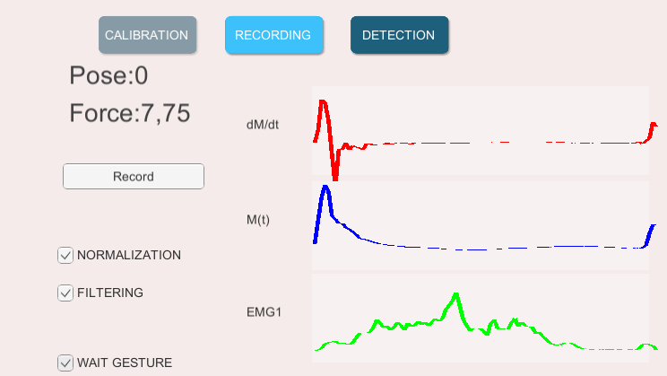

# MyoArmControl
Research of mechanical control via myoelectrical signals using Myo Armband. 
Student work in Technical University of Liberec (TUL).

## Targets
- find optimal EMG signal filtering method (in accuracy and computational cost)
- create effective ML model for gesture recognition
- move this model on remote device (such Arduino board) or  coumuter native program
- exercise control

## Requirements 
Python: 3.6
- tensorflow==1.4.0
- keras==2.1.3

Unity: 2019.2.10f
- TensorFlow-Sharp ([Download here](https://s3.amazonaws.com/unity-ml-agents/0.5/TFSharpPlugin.unitypackage))

## Data mining

Unity program was developed on base of the Unity SDK example from MyoArmband developers:

- added the ability to recieve EMG data and vizualize it in graph
- button for writing data to a file with current gesture chose (added as last element of a row)
- integrated neural network model using TensorFlowSharp and real-time gesture recognition with multithreading
- created class with Savitzkiy-Goley filter for processing input data

Write to a file:
- already filtering data
- row is 720 EMG values (90 for each sensor) and last value of gesture code

## Data preprocessing

For better results, the data needs preprocessing. Original EMG signal has fast large differences of values. For its approximation I chose Savitzkiy-Goley filter with 9 points of calculate moving average and 2nd polynom order.

([Useful link about such filtering](http://195.134.76.37/applets/AppletSmooth/Appl_Smooth2.html))

#### Comparison filters with different points count:

## Create and fitting model

Recurent neural network model was choised as more effective in time series and human action recognition.
Architecture includes few LSTM layers with dropout to avoid overfitting:

- Input layer 8*90
- LSTM layer with 50 units and 0,2 dropout
- LSTM layer with 50 units and 0,2 dropout
- LSTM layer with 50 units and 0,2 dropout
- LSTM layer with 50 units and 0,2 dropout
- Ordinary layer with 64 units
- Ordinary layer with 128 units
- Output layer with 3 options

([Wiki about LSTM](https://en.wikipedia.org/wiki/Long_short-term_memory))

